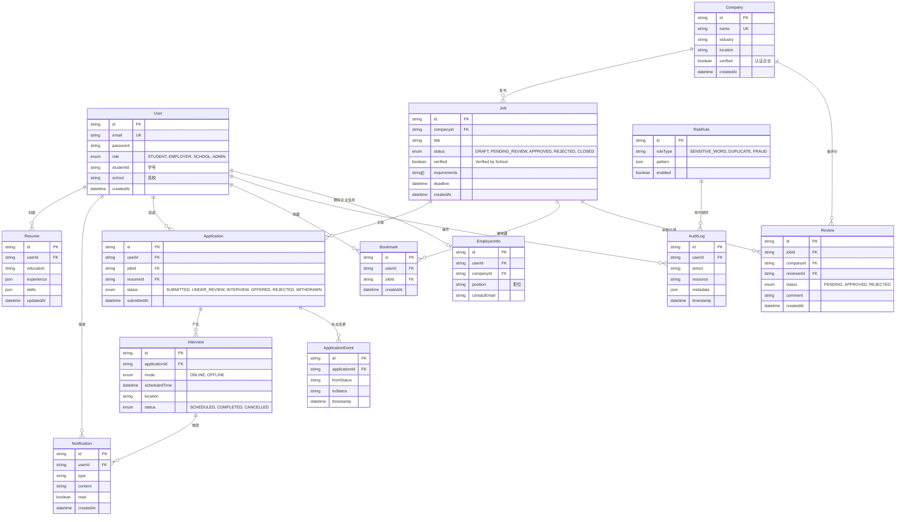

软件需求规格说明书（SRS）
========================

目录
----

0. 文档信息（Document Information）  
1. 引言（Introduction）  
2. 总体描述（Overall Description）  
3. 外部接口需求（External Interface Requirements）  
4. 系统特性 / 功能需求（System Features / Functional Requirements）  
5. 其他非功能性需求（Other Nonfunctional Requirements）  
6. 其他需求（Other Requirements）  
附录 A. 术语表（Glossary）  
附录 B. 分析模型（Analysis Models）  

---

0 文档信息（Document Information）
---------------------------------

### 0.1 文档基本信息（Basic Information）

- **项目名称**：JobVerse 面向高校学生的智能一体化招聘平台  
- **文档名称**：软件需求规格说明书（Software Requirements Specification, SRS）  
- **项目组成员**：2354284 胡永杰 / 2351134 吕奎辰 / 2353594 姜政言 / 2353922 朱会佳 

---

1 引言（Introduction）
---------------------

### 1.1 目的（Purpose）

本软件需求规格说明书（SRS）用于系统性地描述 JobVerse 一体化招聘平台的需求，包括功能需求、外部接口需求、性能与安全等非功能需求，以及相关业务规则与约束条件。  
本文件将作为 JobVerse 项目需求的**正式基线**，为后续的架构设计、详细设计、实现开发、测试用例设计、系统验收以及运维支持提供统一依据，并作为项目相关方进行沟通和评审的共同参考文档。  
当其他设计文档、实现或测试行为与本 SRS 不一致时，应以经评审通过且最新版本的本 SRS 为准。  

### 1.2 文档约定（Document Conventions）

- 术语约定：  
  - “**必须 / 应当**（shall）”表示强制性需求；  
  - “**应该**（should）”表示重要但在特定情况下可以不满足的需求；  
  - “**可以**（may）”表示可选需求。  
- 需求编号约定（示例）：  
  - 功能需求：`FR-<模块缩写>-序号`，如 `FR-SEARCH-01`；  
  - 非功能需求：`NFR-<类别缩写>-序号`，如 `NFR-PERF-01`；  
  - 接口需求：`IF-<类型>-序号`，如 `IF-API-01`。  
- 优先级约定：P0（Must Have）、P1（Should Have）、P2（Could Have）。  

### 1.3 预期读者与阅读建议（Intended Audience and Reading Suggestions）

- **预期读者**：  
  - 指导教师和评审人员：了解系统范围、需求完备性与合理性，用于评估项目质量；  
  - 项目组成员（需求、设计、前端、后端、测试等）：在统一的需求基线上开展设计、实现与测试工作。  

- **阅读建议**：  
  - 建议首先阅读第 1 章“引言”和第 2 章“总体描述”，以整体把握系统背景、范围和主要用户；  
  - 负责实现具体功能的组员可重点阅读第 3 章“外部接口需求”和第 4 章“系统特性 / 功能需求”；  
  - 关注性能、安全与稳定性的组员可重点阅读第 5 章“其他非功能性需求”；  
  - 附录部分提供术语表、分析模型，可在需要时查阅，用于支撑设计与测试。 

### 1.4 项目范围（Project / Product Scope）

JobVerse 是一款面向高校在校生与应届毕业生、中小企业/初创公司以及高校就业指导中心的**轻量级一体化招聘平台**。系统采用 B/S 架构，通过统一的 Web 前端与后端服务，为学生提供可信的岗位信息与透明的求职进展，为用人企业提供低门槛的校招发布与候选人管理能力，并为高校提供集中审核与质量把控能力，从而在“学生 – 中小企业 – 学校”三方之间建立一条可追溯、可审计的招聘通路。  

在功能范围上，系统主要包括三个前端子系统及其支撑服务：  
- 面向学生的求职端：支持按关键词/地区/薪资等条件进行职位搜索与筛选，查看岗位详情与企业基础画像，收藏职位、查看与跟踪个人投递记录等；  
- 面向中小企业招聘负责人的企业端：支持以简单表单发布和管理岗位，查看来自学生的投递并在少量固定状态之间流转（如已投递、已查看、面试中、已录用/不合适），不建模企业内部复杂审批流程；  
- 面向高校就业中心与平台管理员的管理端：支持对岗位与企业信息进行审核并授予或撤销“Verified by School”等可信标识，维护敏感词与基础风控规则，查看关键操作审计记录及少量运行指标。  

在当前阶段，JobVerse 聚焦于上述 MVP 范围：实现基于关键词检索与简单排序的职位搜索、`Verified by School` 驱动的企业/岗位可信展示、轻量级岗位发布与候选人状态管理、基础风控与审计能力。复杂的企业内部多级审批工作流、基于大规模行为数据的推荐与学习重排、与真实企业工商数据源和生产级消息/监控平台的深度集成等，将通过清晰的接口与架构预留为后续可扩展方向，而不纳入当前实现范围。

### 1.5 参考资料（References）

本 SRS 的编写主要参考了以下标准与教材：

- Pressman, 《软件工程：实践者的研究方法》第 9 版，需求工程与设计相关章节；  
- IEEE Std 830 / IEEE Std 29148, *Software Requirements Specification*。  

---

2 总体描述（Overall Description）
--------------------------------

### 2.1 产品背景与系统环境（Product Perspective）

JobVerse 属于一套全新的基于 Web 的 B/S 架构招聘系统，不依附于既有的校园就业系统或企业 ATS，而是面向高校在校生与应届毕业生、中小企业/初创公司以及高校就业指导中心，提供“职位搜索 + 岗位发布 + 校方审核”的一体化在线服务。与传统面向大型企业、流程复杂的 ATS 系统不同，JobVerse 更侧重于为资源有限的中小企业提供轻量级的招聘工具，并通过高校审核机制提升岗位与企业信息的可信度。  

在系统环境层面，JobVerse 的整体结构可概括为：  
- **Web 客户端层**：统一的 Web 前端，按角色呈现学生求职端、企业端和管理端三个视图，支持职位搜索与浏览、岗位发布与候选人管理、岗位审核与风控配置等功能；  
- **服务与业务层**：后端通过一组服务组件支撑核心业务，包括搜索与筛选服务、岗位与候选人管理服务、岗位审核与标记服务（含 “Verified by School”）、基础风控服务（敏感词与重复检测）、配置与词典管理等；  
- **数据与存储层**：使用关系型数据库存储用户、企业、岗位及投递记录等结构化数据，配合搜索索引（全文/关键词检索）和缓存，以支撑高效的职位检索与列表展示；  
- **日志与审计层**：记录关键业务操作和风控决策，用于后续问题排查、统计分析和合规审计。  

系统在运行过程中，还将与若干外部或预留对接的系统交互，这些外部系统不在本产品范围内实现，仅通过接口或模拟方式使用，包括但不限于：  
- 企业工商与风险信息数据源（如工商信息查询服务等，当前版本视为可选的预留扩展），用于丰富企业画像和辅助风险评估；  
- 统一身份认证或第三方登录服务（如 OAuth2/OIDC 身份提供方），用于实现单点登录或校园账号登录；  
- 日志与监控平台，用于采集运行指标和错误信息。  

通过上述分层结构与清晰的系统边界，JobVerse 可以在不改变企业内部既有审批流程的前提下，为“学生 – 中小企业 – 学校”三方提供一个相对独立、接口清晰且便于后续扩展的在线招聘与校验平台。  

### 2.2 产品功能概览（Product Functions）

从系统整体视角看，JobVerse 的主要功能可按前端角色与后端支撑服务划分为以下几个模块（详细功能需求将在第 4 章展开）：

- **求职端模块（面向学生）**：  
  - 提供基于关键词/地区/薪资等条件的职位搜索与筛选能力，支持职位列表浏览与分页；  
  - 展示职位详情与企业基础画像信息，包括 `Verified by School` 等可信标识与风险提示；  
  - 支持职位收藏与投递操作，并提供个人投递记录与进度查看入口。  
  - 提供“消息中心/通知”入口，展示与投递、面试与审核相关的站内通知（演示增强）；  
  - 提供“简历中心”能力，支持维护默认简历/多份简历，并在投递时选择简历与求职信（演示增强）。  

- **企业端模块（面向中小企业招聘负责人）**：  
  - 提供轻量级的职位创建、编辑、发布与下线管理能力，以一屏表单完成常用岗位信息配置；  
  - 按岗位查看候选人列表，基于少量固定状态（如已投递、已查看、面试中、已录用/不合适）管理候选人进展；  
  - 将岗位提交至高校就业中心或平台管理员审核，查看审核结果与 `Verified by School` 标识状态。  
  - 支持对候选人记录内部备注/反馈，并发起面试邀请与管理面试安排（演示增强）。  

- **管理端模块（面向高校就业中心与平台管理员）**：  
  - 对企业提交的岗位与企业信息进行审核，通过后授予或撤销 `Verified by School` 等可信标识；  
  - 维护敏感词与重复职位检测等基础风控规则，对违规或可疑内容执行拦截、标记或降权处理；  
  - 查看关键操作审计信息和基础运行指标，用于把控平台信息质量与合规性。  

- **系统服务与基础设施模块**：  
  - 搜索与筛选服务：负责职位搜索请求的解析、过滤条件处理及结果排序，与索引/数据库协同工作；  
  - 业务与数据服务：管理用户、企业、岗位、投递记录等核心业务数据，并提供统一的数据访问接口；  
  - 风控与词典服务：支撑敏感词、同义词、重复检测等规则的配置与执行，保障内容质量；  
  - 日志与审计服务：采集与存储业务操作、风控决策和系统事件，为问题排查和合规审计提供依据。  
  - 通知与事件服务（演示增强）：对投递/面试/审核等关键事件生成站内通知，支持已读管理与未读提醒。  

### 2.3 用户类别及特征（User Classes and Characteristics）

本系统的主要用户类别及其特征如下：

- **学生求职者（在校生 / 应届毕业生）**  
  - 使用频率：在求职季或实习季高频使用，平时以浏览和收藏为主；  
  - 典型特征：对招聘流程和市场情况不够熟悉，更关注岗位真实性、企业可信度、职位匹配度和投递进度是否可见；  
  - 主要目标：通过多条件搜索快速发现合适的职位，了解企业可靠性，方便地投递与跟踪求职进展。  

- **中小企业招聘负责人（企业用户）**  
  - 使用频率：在有招聘需求的阶段频繁使用，集中进行岗位发布、简历筛选与沟通；  
  - 典型特征：人力与时间资源有限，不一定具备专业 ATS 使用经验，希望以较低学习成本完成校招相关工作；  
  - 主要目标：用简单表单快速发布岗位，在一个界面内管理候选人状态，并通过高校审核获得 `Verified by School` 等可信标识，提升对学生的吸引力。  

- **高校就业指导中心用户（学校端）**  
  - 使用频率：在校招季较为频繁，用于审核岗位与企业信息；  
  - 典型特征：关注岗位真实性、与学校政策的匹配度以及对学生的风险控制，对复杂业务系统的容忍度有限；  
  - 主要目标：高效完成岗位审核与标记“Verified by School”，为学生提供经过核验的职位列表，并保留可追溯的审核记录。  

- **平台管理员（平台运营 / 技术运维角色）**  
  - 使用频率：中等偏高，主要在配置规则、监控系统运行、排查问题时使用；  
  - 典型特征：具备一定技术背景或运营经验，需要从全局视角掌握平台运行状态与数据质量；  
  - 主要目标：维护敏感词和重复检测等风控规则，查看审计日志和基础运行指标，保障平台稳定、安全和合规运行。  

### 2.4 运行环境（Operating Environment）

JobVerse 作为基于 Web 的 B/S 架构系统，其运行环境要求主要包括前端客户端环境和后端服务部署环境两个方面：

- **前端客户端环境**：  
  - 浏览器：支持现代浏览器的当前和最近两个主要版本，例如 Chrome、Edge、Firefox、Safari 等；  
  - 终端设备：支持桌面端（Windows / macOS / Linux）与移动端设备（iOS / Android）通过浏览器访问，界面采用响应式设计以适配常见分辨率；  
  - 网络环境：在校园网和普通公网环境下可正常访问，推荐带宽不低于 10 Mbps，延迟在 200ms 以内可获得较好体验；  
  - 其他要求：客户端需支持 JavaScript、Cookie 和本地存储，用于实现会话管理和基础交互。  

- **后端服务与数据环境**：  
  - 服务器操作系统：运行于主流 Linux 发行版（如 Ubuntu Server / Debian 等），支持容器化部署（如 Docker）或直接部署；  
  - 应用运行时：使用 Node.js 运行时（版本满足 Next.js/Node 服务要求），结合相关包管理工具（npm / yarn 等）；  
- 数据库与存储：采用关系型数据库（如 PostgreSQL 或 MySQL）存储业务数据，可选配全文/关键词搜索引擎（如 Elasticsearch/OpenSearch）以支持检索能力；  
- 缓存：如需要，可使用 Redis 等缓存组件提升读写性能；  
  - 安全与访问：通过 HTTPS 提供外部访问，服务所在环境应具备基础网络隔离、防火墙和访问控制能力。  

本小节仅作为运行环境约束的概述，具体的部署拓扑、容量规划及高可用方案将在设计与实现阶段进一步细化。  

### 2.5 设计与实现约束（Design and Implementation Constraints）

JobVerse 的设计与实现受到以下约束条件影响，这些约束会在后续架构与详细设计中予以体现：

- **技术栈约束**  
  - 前端采用 React / Next.js 技术栈，优先使用已有组件库与工程化工具，以降低学习和集成成本；  
  - 后端基于 Node.js 及 TypeScript（或 JavaScript）实现，结合 RESTful 风格 API 提供服务；  
  - 数据存储以关系型数据库为主，并在需要时引入专用搜索引擎和缓存组件，但不引入过于沉重或难以维护的分布式中间件。  

- **时间与资源约束**  
  - 项目开发周期和人员规模有限，系统在初始版本中需聚焦于 MVP 功能范围（核心搜索、岗位发布与审核、基础风控和审计），复杂工作流和高级推荐等作为后续扩展方向；  
  - 在保证关键路径可用性和体验的前提下，部分非关键特性（如复杂报表、全面可视化配置界面等）可采用简化实现或暂不实现。  

- **法律与合规约束**  
  - 需遵循个人信息保护和数据安全相关法规精神（如 PIPL、网络安全法、数据安全法等），在设计时坚持最小必要原则，避免收集与展示过多敏感信息；  
  - 对涉及个人联系方式、企业敏感信息的数据进行脱敏或访问控制，关键操作需具备可审计性。  

- **部署与运行环境约束**  
  - 系统需能够在资源有限的服务器或云环境中部署运行，避免依赖过高的硬件配置；  
  - 设计上应支持单实例或少量实例部署，并预留水平扩展空间，但不强制要求复杂的多机房或跨区域部署方案。  

### 2.6 用户文档（User Documentation）

为保证不同角色用户能够正确理解并使用系统，JobVerse 计划提供以下用户文档和说明材料（形式可以为在线文档或离线文档）：

- **学生端使用指南**  
  - 覆盖账号登录/注册、职位搜索与筛选、企业画像查看、职位收藏与投递、投递记录与进度查看等功能；  
  - 以步骤说明和截图示例为主，强调如何识别 `Verified by School` 等可信标识。  

- **企业端使用指南（中小企业招聘负责人）**  
  - 介绍企业信息完善、岗位创建与发布、候选人列表查看与状态更新、查看岗位审核状态等；  
  - 提供常见问题说明，如岗位被驳回时的修改建议、如何提升岗位通过率等。  

- **管理端与平台管理员操作手册**  
  - 覆盖岗位与企业信息审核流程、标记和撤销 `Verified by School` 的操作步骤；  
  - 说明敏感词与重复检测规则的配置方法，以及审计日志和基础运行指标的查看方式。  

### 2.7 假设与依赖（Assumptions and Dependencies）

本系统在设计与实现过程中，基于以下关键假设与外部依赖，这些因素一旦发生变化，可能需要重新评估或调整相关方案：

- **环境与基础设施假设**  
  - 假设部署环境能够提供稳定的网络连接和基本的计算与存储资源，足以支撑预期并发量下的系统运行；  
  - 假设运行环境支持 HTTPS 访问、基础防火墙和访问控制配置。  

- **外部服务与数据依赖**  
  - 依赖学校或统一身份认证服务（或其简化替代方案），用于学生和管理端用户的身份验证；  
  - 当前版本不依赖外部企业工商/企业信息数据源，企业信息主要来源于企业自报字段、学校审核结果以及平台内部规则（如举报记录等）；如未来接入外部企业信息服务，将在设计阶段单独评估并补充接口说明；  
  - 可选依赖特定云平台或数据库服务提供商，以获得数据库托管、对象存储或监控等能力。  

- **组织与使用方式假设**  
  - 假设高校就业指导中心或相关管理方会承担对岗位与企业的审核职责，并在系统中保持相对稳定的使用频率；  
  - 假设中小企业愿意按照平台规则更新岗位信息与候选人状态，以维持职位信息的时效性与可信度；  
  - 假设学生用户具备基本的 Web 使用能力，能够通过浏览器完成搜索、查看和投递等基本操作。  

---

3 外部接口需求（External Interface Requirements）
--------------------------------------------------

### 3.1 用户界面（User Interfaces）

本节从用户视角概述 JobVerse 的主要界面类型及其输入/输出和核心行为，详细交互与原型可在单独的 UI 文档中给出。

- **学生端界面**  
  - 职位搜索页：  
    - 输入：关键词、地区、薪资范围、职位类型等检索条件；分页/排序选项；  
    - 输出：符合条件的职位列表（职位名称、企业名称、地点、薪资范围、`Verified by School` 标识、简要标签等）；  
    - 行为：修改筛选条件重新查询、点击职位进入详情、收藏职位、发起投递。  
  - 职位详情页：  
    - 输出：职位完整信息（描述、要求、薪资范围、工作地点、标签等）、所属企业摘要信息及 `Verified by School` 状态；  
    - 行为：投递简历、收藏/取消收藏、跳转查看企业详情。  
  - 企业详情页（企业画像）：  
    - 输出：企业基本信息、认证与 `Verified by School` 标识、风险提示（如有）、历史岗位概览；  
    - 行为：从职位详情或搜索结果点击企业名称进入，仅展示信息，不进行编辑。  
  - 我的收藏与投递记录页：  
    - 输出：已收藏职位列表、已投递职位列表及当前状态（已投递/已查看/面试中/已录用/不合适等）；  
    - 行为：取消收藏、查看职位详情、查看投递进度。  
  - 投递详情页（时间线）：  
    - 输出：单条投递记录的事件时间线（投递、已查看、面试邀请、状态更新等）、企业反馈（如有）；  
    - 行为：查看投递进度详情、查看面试信息、确认/拒绝面试邀请（如有）。  
  - 消息中心/通知页：  
    - 输出：站内通知列表（投递成功、状态更新、面试邀请、审核结果等）及未读数量；  
    - 行为：查看通知详情、跳转关联页面、标记已读/全部已读。  
  - 简历中心页：  
    - 输入：简历内容/链接、简历名称、默认简历设置、求职信模板（可选）；  
    - 输出：简历列表与默认简历状态；  
    - 行为：新增/编辑/删除简历，设置默认简历。  

- **企业端界面（中小企业招聘负责人）**  
  - 岗位列表/管理页：  
    - 输出：该企业已创建岗位列表（草稿/待审核/已上线/已下线等状态）；  
    - 行为：新建岗位、编辑岗位、提交审核、上下线岗位。  
  - 岗位编辑/创建页：  
    - 输入：职位名称、工作地点、薪资范围、职位描述、任职要求、职位标签、有效期等；  
    - 行为：保存草稿、提交审核；  
    - 反馈：表单校验错误提示、提交成功/失败信息。  
  - 候选人列表页：  
    - 输出：按岗位分类的候选人列表（姓名、学校、专业、投递时间、当前状态等，部分信息脱敏）；  
    - 行为：筛选候选人、查看候选人详情（含简历）、更新候选人状态（如已查看、面试中、已录用/不合适）、记录备注。  
  - 面试安排/候选人详情页（或弹窗）：  
    - 输入：面试时间、面试方式（线下/线上）、地点/会议链接、备注；  
    - 输出：面试邀请状态、候选人确认状态、历史沟通记录（如有）；  
    - 行为：发起/修改/取消面试邀请，填写企业反馈（可选）。  

- **管理端界面（高校就业指导中心 / 平台管理员）**  
  - 待审核岗位列表页：  
    - 输出：待审核岗位列表（企业名称、职位名称、提交时间、风险标记等）；  
    - 行为：条件筛选、进入岗位审核详情。  
  - 岗位审核详情页：  
    - 输出：岗位详细信息、企业基础信息及历史记录、风控检测结果（如敏感词或重复提示）；  
    - 行为：审核通过/驳回/退回修改，填写审核意见，设置或撤销 `Verified by School` 标识。  
  - 风控规则配置页（平台管理员）：  
    - 输入：敏感词规则、重复检测阈值、处理策略（拦截/标记/降权/人工复核）；  
    - 输出：当前规则列表与生效状态；  
    - 行为：新增/修改/启用/停用规则。  
  - 审计日志与基础监控页：  
    - 输出：关键操作日志（时间、操作者、操作对象与结果）的查询结果、基础指标（如岗位总数、通过率等）；  
    - 行为：按条件查询日志、导出日志数据（如需要）。  

### 3.2 硬件接口（Hardware Interfaces）

JobVerse 为典型的 Web 应用系统，不直接控制或驱动专用硬件设备，其硬件接口需求主要体现在以下两点：

- **服务器与基础设施**：  
  - 应用后端和数据库运行在通用服务器或云主机之上，使用标准网络接口（TCP/IP）进行通信；  
  - 不依赖特定型号或厂商的专用硬件设备。  

- **用户终端设备**：  
  - 学生、企业用户和管理端用户通过具备标准浏览器的 PC 或移动设备访问系统；  
  - 本系统不直接与刷卡机、门禁设备等物理硬件进行集成，如未来需要此类集成，将在后续版本中单独补充硬件接口说明。  

因此，在当前范围内，硬件接口可视为依赖“通用服务器 + 标准网络终端”的软硬件环境，无需定义专用硬件协议。

### 3.3 软件接口（Software Interfaces）

本节描述 JobVerse 与其他软件组件或服务之间的接口，重点包括内部数据存储与可选的外部服务。为避免过度依赖不确定的第三方 API，所有外部接口均设计为**可替换或可模拟**，并在实现阶段验证其可用性。

- **内部数据存储与服务接口**  
  - 关系型数据库接口：  
    - 方向：应用服务 ↔ 数据库；  
    - 数据：用户信息、企业信息、岗位、投递记录、审核记录、风控规则、审计日志等结构化数据；  
    - 约定：通过 ORM 或 SQL 访问，保证事务一致性和基础约束（主键、外键、唯一约束等）。  
  - 搜索/索引服务接口（如采用独立搜索引擎时）：  
    - 方向：应用服务 → 搜索引擎；  
    - 数据：岗位文档索引（标题、地点、薪资范围、标签等）；  
    - 功能：同步索引、根据查询条件获取职位列表；  
    - 说明：如未引入独立搜索引擎，可由数据库查询承担搜索职责，此接口视为内部实现细节。  

- **鉴权与身份服务接口**  
  - 统一身份认证或自建登录模块：  
    - 方向：Web 前端 → 认证服务（可为本系统自带登录模块，或学校提供的统一认证服务）；  
    - 数据：用户名/密码或学校账号凭据，返回登录结果与会话/令牌信息；  
    - 要求：如接入外部统一认证服务，需要在实现前确认接口协议（如 OAuth2/OIDC）和可用性，并在不可用时提供本地登录或 Mock 方案。  

- **企业信息数据源接口（可选，预留扩展）**  
  - 说明：当前版本的企业画像主要基于企业自报信息、学校审核结果与平台内部规则（如是否多次被举报），不依赖外部企业信息 API；  
  - 预留扩展点：如未来需要接入企业工商/风险信息服务，可在应用服务与企业信息服务（或官方数据集）之间增加查询接口（以企业统一社会信用代码或名称为关键字，获取企业基本信息与部分风险提示），并在单独的接口文档中说明具体协议与数据格式。  

### 3.4 通信接口（Communications Interfaces）

JobVerse 在网络通信层面的主要接口和要求如下：

- **对外 Web 通信**  
  - 协议：HTTP/1.1 或更高版本，外部访问必须通过 HTTPS（TLS 加密）；  
  - 数据格式：前后端之间的 API 调用统一使用 JSON 作为请求/响应体格式；  
  - 编码：统一采用 UTF-8 字符编码；  
  - 端口：默认使用标准 HTTPS 端口（443），具体端口配置视部署环境而定。  

- **服务内部通信**  
  - 应用服务与数据库/搜索引擎/缓存之间通过内部网络使用 TCP/IP 协议通信；  
  - 如引入消息队列，生产者与消费者通过队列系统提供的标准协议（如 Kafka/AMQP 等）进行交互。  

- **安全与性能要求**  
  - 所有对外接口须通过 TLS 保护，避免明文传输敏感信息；  
  - 需要对关键接口设置合理的超时时间与重试策略，避免长时间阻塞导致系统不可用；  
  - 如未来采用 WebSocket 或 Server-Sent Events 实现实时通知，应在相应接口的协议、鉴权和资源占用方面进行单独设计与评估。  

在当前范围内，系统主要采用基于 HTTPS + JSON 的请求/响应模式进行通信，避免过多依赖复杂的实时通信机制，同时预留后续扩展空间。  

---

4 系统特性 / 功能需求（System Features / Functional Requirements）
--------------------------------------------------------------------

### 4.1 系统特性：职位搜索与筛选（System Feature: Job Search & Filtering）

#### 4.1.1 描述与优先级（Description and Priority）

本特性为学生求职者提供基于关键词、地区、薪资范围、职位类型等多条件的职位搜索与筛选能力，是求职端的核心入口。  
在当前阶段，系统以**关键词检索 + 组合过滤 + 简单排序**为主，预留向语义检索与相关性排序演进的空间。该特性整体优先级为 **P0**。  

#### 4.1.2 触发 / 响应序列（Stimulus/Response Sequences）

- 学生在职位搜索页输入关键词（如“前端开发”）、选择地区和薪资范围等条件，并点击“搜索”；  
- 系统对输入条件进行基本校验（必填项、格式等），构造搜索请求；  
- 系统根据条件在职位数据中执行检索与筛选，并按默认排序（例如“综合排序/发布时间”等）生成结果列表；  
- 系统在规定时间内返回结果页，展示符合条件的职位列表、结果总数及分页控件；  
- 学生可以调整筛选条件或排序方式，重新发起搜索。  

#### 4.1.3 功能需求（Functional Requirements）

- `FR-SEARCH-01`（P0）：系统**应当**允许学生根据关键词、工作地点、薪资范围和职位类型等条件组合检索职位。  
- `FR-SEARCH-02`（P0）：系统**应当**在职位名称、企业名称和职位描述等字段上支持关键词匹配，返回包含任一关键词的职位记录。  
- `FR-SEARCH-03`（P0）：系统**应当**支持对搜索结果进行分页展示，并允许用户在结果页中切换页码。  
- `FR-SEARCH-04`（P0）：系统**应当**至少支持按“综合排序/默认”“按发布时间倒序”“按薪资范围”三种方式对搜索结果进行排序。  
- `FR-SEARCH-05`（P0）：当搜索结果为空时，系统**应当**向用户提示“未找到符合条件的职位”，并建议放宽或调整筛选条件。  
- `FR-SEARCH-06`（P1）：系统**应该**在结果列表中对命中的关键词进行高亮或其他视觉提示，帮助用户快速识别匹配原因。  
- `FR-SEARCH-07`（P1）：系统**应该**支持对常见输入错误（如简单拼写错误）给出更正建议或宽松匹配，提升搜索可用性。  
- `FR-SEARCH-08`（P0）：在正常负载下，系统**应当**保证大部分（例如 95%）职位搜索请求在 2 秒内返回结果列表。  

### 4.2 系统特性：企业与岗位可信画像（System Feature: Company & Job Trust Profile）

#### 4.2.1 描述与优先级（Description and Priority）

本特性面向学生求职者，在职位详情页和企业详情页中展示企业自报信息、岗位关键信息、`Verified by School` 标识以及基于平台内部规则生成的基础风险提示，帮助学生判断岗位和企业的可信度。  
企业与岗位可信画像能力是平台差异化价值的重要组成部分，其核心展示能力优先级为 **P0**，风险提示等增强能力为 **P1**。  

#### 4.2.2 触发 / 响应序列（Stimulus/Response Sequences）

- 学生在职位搜索结果中点击某一职位，系统跳转至职位详情页；  
- 系统在职位详情中展示岗位关键信息（名称、地点、薪资范围、描述、要求、标签等）及所属企业的基础信息摘要；  
- 如该岗位或企业已通过高校审核，系统在显著位置展示 `Verified by School` 标识；  
- 学生在职位详情页点击企业名称，系统跳转至企业详情页；  
- 系统在企业详情页展示企业自报信息（名称、规模、行业、地址、简介等）、与学校审核相关的信息，以及（如有）基于内部规则生成的风险提示或历史举报概览。  

#### 4.2.3 功能需求（Functional Requirements）

- `FR-PROFILE-01`（P0）：系统**应当**在职位详情页展示岗位名称、工作地点、薪资范围、职位描述、任职要求和职位标签等关键信息。  
- `FR-PROFILE-02`（P0）：系统**应当**在职位详情页展示所属企业的基础信息摘要（例如企业名称、规模、行业、所在城市等），并提供跳转至企业详情页的链接。  
- `FR-PROFILE-03`（P0）：对于已通过高校审核的岗位或企业，系统**应当**在职位详情页和/或企业详情页醒目展示 `Verified by School` 标识。  
- `FR-PROFILE-04`（P0）：系统**应当**在企业详情页展示企业自报的关键信息（名称、统一社会信用代码/工商注册号如有、成立时间、规模、行业、地址、简介等），并对联系方式等敏感信息进行必要脱敏。  
- `FR-PROFILE-05`（P1）：系统**应该**根据平台内部规则（例如多次被举报、频繁被审核驳回等）为企业生成基础风险提示，并在企业详情页/职位详情页适当位置进行展示。  
- `FR-PROFILE-06`（P1）：系统**应该**在企业详情页中展示该企业当前在招职位列表或历史发布记录的简要统计信息（例如在招岗位数量、历史岗位数）。  

### 4.3 系统特性：职位收藏与求职记录（System Feature: Job Bookmarking & Application Tracking）

#### 4.3.1 描述与优先级（Description and Priority）

本特性为学生提供职位收藏与求职记录管理能力，使其能够保存感兴趣的职位并查看投递历史与当前状态，便于规划和跟踪求职过程。  
职位收藏与基本求职记录能力优先级为 **P0**，更丰富的进度时间线和筛选功能可视为 **P1** 增强。  

#### 4.3.2 触发 / 响应序列（Stimulus/Response Sequences）

- 学生在职位列表或职位详情页点击“收藏”按钮，系统记录收藏关系并更新收藏状态；  
- 学生进入“我的收藏”页面，系统展示已收藏的职位列表，支持跳转到对应职位详情；  
- 学生在职位详情页点击“投递简历”，系统创建一条投递记录，并将其纳入学生的求职记录；  
- 学生在“我的投递”页面查看历史投递列表及每条投递的当前状态（如已投递、已查看、面试中、已录用/不合适等）。  

#### 4.3.3 功能需求（Functional Requirements）

- `FR-BOOK-01`（P0）：系统**应当**允许学生在职位列表和职位详情页对职位执行“收藏/取消收藏”操作。  
- `FR-BOOK-02`（P0）：系统**应当**为每位学生维护其收藏职位列表，并提供“我的收藏”页面展示已收藏职位的概要信息及跳转链接。  
- `FR-BOOK-03`（P0）：当学生对已收藏职位再次执行收藏操作时，系统**应当**识别为“取消收藏”并从收藏列表中移除该职位。  
- `FR-APP-01`（P0）：系统**应当**在学生投递职位时创建一条投递记录，至少包含学生 ID、职位 ID、投递时间和初始状态（例如“已投递”）。  
- `FR-APP-02`（P0）：系统**应当**为每位学生提供“我的投递”页面，按时间或职位展示其历史投递记录及当前状态。  
- `FR-APP-03`（P1）：系统**应该**支持在“我的投递”页面按状态（如进行中、已完成等）对投递记录进行过滤或分组展示。  

### 4.4 系统特性：岗位创建与提交（企业端）（System Feature: Job Creation & Submission）

#### 4.4.1 描述与优先级（Description and Priority）

本特性面向中小企业招聘负责人，提供岗位创建、编辑、保存草稿及提交高校/平台审核的能力，是企业端进行校招岗位发布的基础功能。  
岗位创建与提交为企业端的核心能力，整体优先级为 **P0**。  

#### 4.4.2 触发 / 响应序列（Stimulus/Response Sequences）

- 企业招聘负责人登录企业端，进入“岗位管理”页面并点击“新建岗位”；  
- 系统展示岗位创建表单，招聘负责人填写职位名称、地点、薪资范围、职位描述、任职要求、职位类型、标签、有效期等字段；  
- 招聘负责人可以选择“保存草稿”暂存未完成的岗位信息，或在内容完整且通过校验后选择“提交审核”；  
- 系统对表单内容进行校验，通过后将岗位状态更新为“待审核”，并在岗位列表中展示相应状态；  
- 如表单校验失败，系统给出明确的错误提示，引导用户修正。  

#### 4.4.3 功能需求（Functional Requirements）

- `FR-JOB-01`（P0）：系统**应当**提供岗位创建表单，至少包含职位名称、工作地点、薪资范围、职位描述、任职要求、职位类型（全职/实习等）、职位标签和有效期等字段。  
- `FR-JOB-02`（P0）：系统**应当**允许企业招聘负责人将未完成的岗位信息保存为草稿，并在岗位列表中以“草稿”状态展示，支持后续继续编辑。  
- `FR-JOB-03`（P0）：系统**应当**对岗位创建/编辑表单进行基本校验（如必填字段不能为空、薪资范围有效、文本长度限制等），并在校验失败时给出具体错误提示。  
- `FR-JOB-04`（P0）：当岗位信息通过校验且用户选择“提交审核”时，系统**应当**将岗位状态更新为“待审核”，并记录提交时间和提交人信息。  
- `FR-JOB-05`（P0）：未经高校/平台审核通过的岗位，系统**应当**禁止其在学生端对外展示。  
- `FR-JOB-06`（P1）：系统**应该**允许企业复制已有岗位信息用于快速创建相似岗位，以减少重复录入工作量。  

### 4.5 系统特性：候选人列表与状态管理（System Feature: Candidate List & Status Management）

#### 4.5.1 描述与优先级（Description and Priority）

本特性为企业端提供按岗位查看候选人列表和管理候选人状态的能力，以看板式或列表式形式辅助招聘负责人跟进简历筛选与面试进展。  
候选人列表与基础状态管理属于企业端核心能力，整体优先级为 **P0**。  

#### 4.5.2 触发 / 响应序列（Stimulus/Response Sequences）

- 企业招聘负责人在企业端选中某一岗位，进入“候选人列表”视图；  
- 系统展示该岗位下所有已投递候选人的列表信息（姓名、学校、专业、投递时间、当前状态等）；  
- 招聘负责人点击某一候选人，查看其详细信息（如简历内容、备注等）；  
- 招聘负责人根据筛选或沟通结果更新候选人状态（如从“已投递”更新为“已查看”“面试中”“已录用/不合适”等）；  
- 系统记录状态变更时间和操作者信息，以备后续追溯。  

#### 4.5.3 功能需求（Functional Requirements）

- `FR-CAND-01`（P0）：系统**应当**在企业端按岗位展示候选人列表，列表中至少包含候选人姓名（或匿名标识）、学校、专业、投递时间和当前状态等字段。  
- `FR-CAND-02`（P0）：系统**应当**允许企业招聘负责人在候选人列表中点击某一候选人，查看其详细信息（包括简历内容和历史备注等）。  
- `FR-CAND-03`（P0）：系统**应当**为候选人状态提供一组预定义状态（如：已投递、已查看、面试中、已录用、不合适等），并允许企业招聘负责人在这些状态之间更新候选人状态。  
- `FR-CAND-04`（P0）：系统**应当**在候选人状态发生变更时记录变更时间和操作者信息，用于后续追溯。  
- `FR-CAND-05`（P1）：系统**应该**支持在候选人列表中按状态、投递时间等条件进行筛选和排序。  

### 4.6 系统特性：岗位审核与 “Verified by School”（System Feature: Job Review & Verification by School）

#### 4.6.1 描述与优先级（Description and Priority）

本特性面向高校就业指导中心用户，提供对企业提交岗位进行审核的能力，并在审核通过后为岗位/企业设置或撤销 `Verified by School` 标识，以提升岗位可信度。  
岗位审核与 `Verified by School` 标识是平台差异化的关键能力，整体优先级为 **P0**。  

#### 4.6.2 触发 / 响应序列（Stimulus/Response Sequences）

- 就业中心用户登录管理端，进入“待审核岗位列表”页面；  
- 系统展示待审核岗位列表，并允许按企业名称、职位类型、提交时间等条件筛选；  
- 就业中心用户选中某一岗位，进入岗位审核详情页，查看岗位信息、企业信息以及平台内部风控提示；  
- 就业中心用户根据审核结果选择“通过”“驳回”或“退回修改”，并填写审核意见；  
- 若审核通过，系统将岗位状态更新为“已审核通过/可上线”，并可为岗位或企业设置 `Verified by School` 标识；  
- 若审核驳回或退回修改，系统记录审核意见，并在企业端显示相应结果和建议修改点。  

#### 4.6.3 功能需求（Functional Requirements）

- `FR-VERIFY-01`（P0）：系统**应当**为高校就业中心用户提供“待审核岗位列表”视图，展示所有处于“待审核”状态的岗位及其关键信息。  
- `FR-VERIFY-02`（P0）：系统**应当**允许就业中心用户在岗位审核详情页查看岗位信息、企业信息以及由风控模块生成的基础风险提示。  
- `FR-VERIFY-03`（P0）：系统**应当**支持就业中心用户对岗位执行“通过”“驳回”“退回修改”等审核操作，并要求填写审核意见。  
- `FR-VERIFY-04`（P0）：当岗位审核通过时，系统**应当**将岗位状态更新为“已审核通过/可上线”，并允许为岗位或企业设置 `Verified by School` 标识；如后续发现问题，系统**应当**支持撤销该标识并记录原因。  
- `FR-VERIFY-05`（P0）：系统**应当**将审核结果和审核意见同步至企业端岗位详情/列表页面，便于企业招聘负责人了解审核情况并进行修改。  
- `FR-VERIFY-06`（P1）：系统**应该**支持就业中心用户按状态、企业、时间范围等条件对历史审核记录进行查询。  

### 4.7 系统特性：基础风控与审计（System Feature: Basic Risk Control & Auditing）

#### 4.7.1 描述与优先级（Description and Priority）

本特性为平台提供基础的内容风控能力（敏感词检测、重复岗位检测等）和关键操作审计能力，用于提升岗位信息质量和系统的可追溯性。  
敏感词与重复检测的最小能力以及关键操作审计日志的记录能力优先级为 **P0**，更丰富的规则配置和统计分析可作为 **P1** 增强。  

#### 4.7.2 触发 / 响应序列（Stimulus/Response Sequences）

- 企业在创建或编辑岗位并提交审核时，系统自动对岗位标题和描述执行敏感词与重复检测；  
- 如检测结果为通过，系统继续岗位提交流程；  
- 如检测到敏感或高度重复内容，系统根据配置执行拦截、标记或降权策略，并向审核或企业端给出相应提示；  
- 当发生关键业务操作（岗位发布、审核通过/驳回、风控规则修改等）时，系统记录审计日志；  
- 管理端用户在审计日志界面按条件查询相关操作记录，用于排查问题或进行合规性检查。  

#### 4.7.3 功能需求（Functional Requirements）

- `FR-RISK-01`（P0）：系统**应当**允许平台管理员维护敏感词规则（包括添加、删除、修改和启用/停用），并在岗位创建/编辑提交前对岗位信息执行敏感词检测。  
- `FR-RISK-02`（P0）：系统**应当**在岗位提交或审核环节执行重复岗位检测（例如基于标题和描述的相似度计算），对疑似重复岗位进行标记或拦截，以降低重复/垃圾信息。  
- `FR-RISK-03`（P0）：当检测到敏感或疑似重复内容时，系统**应当**根据预设策略（拦截、标记或降权）进行处理，并在企业端或审核端给出清晰提示。  
- `FR-RISK-04`（P1）：系统**应该**支持对敏感词和重复检测规则的启用/禁用和阈值调整，并记录规则变更历史。  
- `FR-AUDIT-01`（P0）：系统**应当**对关键业务操作（如岗位创建/提交、审核通过/驳回、风控规则修改、权限变更等）记录审计日志，至少包含操作时间、操作者、操作对象和操作结果等信息。  
- `FR-AUDIT-02`（P0）：系统**应当**为平台管理员提供审计日志查询界面，支持按时间范围、操作类型和操作者等条件进行查询。  
- `FR-AUDIT-03`（P1）：系统**应该**支持将审计日志导出为标准格式（如 CSV），用于离线分析和备份。  

### 4.8 系统特性：消息中心与通知（System Feature: Notification Center）

#### 4.8.1 描述与优先级（Description and Priority）

本特性为学生、企业与管理端用户提供统一的“消息中心/通知”能力，用于汇总展示与投递、面试安排、审核结果等相关的关键事件提醒，增强演示时的“闭环感”和可讲述性。该特性整体优先级为 **P1**。  

#### 4.8.2 触发 / 响应序列（Stimulus/Response Sequences）

- 学生完成岗位投递后，系统生成“投递成功”通知，并向对应企业生成“收到新投递”通知；  
- 企业更新候选人状态或发起面试邀请后，系统向学生生成对应通知；  
- 学校/平台管理员完成岗位审核后，系统向企业生成“审核通过/驳回/退回修改”通知，并提供跳转入口；  
- 用户进入消息中心查看通知列表，系统展示未读数量，并支持标记已读。  

#### 4.8.3 功能需求（Functional Requirements）

- `FR-NOTIF-01`（P1）：系统**应当**在关键业务事件发生时生成站内通知，至少覆盖：投递成功、候选人状态更新、面试邀请/变更、岗位审核结果。  
- `FR-NOTIF-02`（P1）：系统**应当**为每个用户提供消息中心页面，展示通知列表，并显示未读通知数量。  
- `FR-NOTIF-03`（P1）：每条通知**应当**至少包含：通知类型、标题/摘要、关联对象（岗位/投递/面试/审核记录）标识、生成时间、已读状态。  
- `FR-NOTIF-04`（P2）：系统**可以**支持按通知类型筛选（如投递/面试/审核/系统）与批量“全部标记已读”。  

### 4.9 系统特性：面试邀请与安排（System Feature: Interview Scheduling）

#### 4.9.1 描述与优先级（Description and Priority）

本特性支持企业在候选人管理过程中对某条投递发起面试邀请，并允许学生查看与确认/拒绝面试安排，从而让“投递 → 面试 → 录用/不合适”的演示流程更完整。该特性整体优先级为 **P1**。  

#### 4.9.2 触发 / 响应序列（Stimulus/Response Sequences）

- 企业在候选人列表/详情中选择候选人并点击“发起面试”；  
- 系统要求企业填写面试时间、方式（线下/线上）、地点或会议链接、备注等信息；  
- 系统创建面试邀请记录，并向学生发送通知；  
- 学生在投递详情或消息中心查看面试邀请，并确认/拒绝（或提交改期建议）；  
- 企业在企业端查看学生确认状态，并可修改/取消面试邀请。  

#### 4.9.3 功能需求（Functional Requirements）

- `FR-INTV-01`（P1）：系统**应当**允许企业用户为某条投递记录创建面试邀请，至少包含面试时间、面试方式、地点/会议链接与备注字段。  
- `FR-INTV-02`（P1）：系统**应当**允许学生查看与其投递记录关联的面试邀请详情，并展示当前邀请状态。  
- `FR-INTV-03`（P1）：系统**应当**允许学生对面试邀请执行“确认/拒绝”操作；系统**可以**支持学生提交改期建议（可选）。  
- `FR-INTV-04`（P1）：系统**应当**允许企业修改或取消面试邀请，并通过消息中心向学生发送变更通知。  
- `FR-INTV-05`（P2）：系统**可以**为学生与企业提供“面试日程”视图，按时间展示即将到来的面试安排。  

### 4.10 系统特性：投递时间线、状态变更历史与反馈（System Feature: Application Timeline & Feedback）

#### 4.10.1 描述与优先级（Description and Priority）

本特性在“我的投递”基础上，为每条投递记录提供可视化的事件时间线，记录投递后发生的关键动作（如企业查看、状态更新、面试邀请、录用/不合适等），并支持企业填写对学生可见的反馈文本（用于演示解释）。该特性整体优先级为 **P1**。  

#### 4.10.2 触发 / 响应序列（Stimulus/Response Sequences）

- 学生投递岗位后，系统创建投递记录并记录“已投递”时间线事件；  
- 企业查看简历或更新候选人状态时，系统记录对应时间线事件；  
- 企业给出“录用/不合适”结论时，可填写对学生可见的反馈；  
- 学生进入投递详情页，系统展示时间线与反馈内容。  

#### 4.10.3 功能需求（Functional Requirements）

- `FR-APPHIS-01`（P1）：系统**应当**为每条投递记录维护事件时间线，至少包含事件类型、发生时间、操作者角色（学生/企业/学校/系统）与关联对象信息。  
- `FR-APPHIS-02`（P1）：系统**应当**为学生提供投递详情页，展示该投递的时间线，并支持从时间线跳转到关联内容（如面试邀请、岗位详情）。  
- `FR-APPHIS-03`（P1）：系统**应当**在企业更新候选人状态或发起面试邀请时自动写入时间线事件。  
- `FR-APPHIS-04`（P1）：当企业将投递状态更新为“已录用/不合适”时，系统**应该**允许企业填写对学生可见的反馈文本，并在学生端投递详情中展示。  
- `FR-APPHIS-05`（P2）：系统**可以**支持企业为候选人填写仅企业内部可见的备注，用于候选人管理（演示增强）。  

### 4.11 系统特性：简历中心与投递材料管理（System Feature: Resume Center & Application Materials）

#### 4.11.1 描述与优先级（Description and Priority）

本特性为学生提供“简历中心”，用于维护一份或多份简历（文本或链接形式）并设置默认简历；在投递时允许选择简历与填写求职信，从而增强演示时的互动性与完整性。该特性整体优先级为 **P1**。  

#### 4.11.2 触发 / 响应序列（Stimulus/Response Sequences）

- 学生进入简历中心，新增或编辑简历内容/链接，并设置默认简历；  
- 学生在岗位详情页点击“投递”，系统弹出投递对话框（或进入投递页面），默认选中默认简历；  
- 学生选择简历、填写求职信后提交投递；  
- 企业在候选人详情中查看该投递所附带的简历与求职信内容。  

#### 4.11.3 功能需求（Functional Requirements）

- `FR-RESUME-01`（P1）：系统**应当**允许学生维护多份简历（新增/编辑/删除），每份简历至少包含名称与内容（或链接）字段。  
- `FR-RESUME-02`（P1）：系统**应当**允许学生设置一份默认简历，并在投递流程中默认选中该简历。  
- `FR-RESUME-03`（P1）：系统**应当**在投递岗位时允许学生选择简历并填写求职信（可选），并将其与投递记录关联保存。  
- `FR-RESUME-04`（P1）：系统**应当**允许企业在候选人详情中查看该投递记录对应的简历与求职信。  
- `FR-RESUME-05`（P2）：系统**可以**将投递时的简历内容以快照方式保存到投递记录中，避免学生后续修改简历导致历史投递内容发生变化（演示增强）。  

### 4.12 系统特性：保存搜索、岗位订阅与简易推荐（System Feature: Saved Search, Subscription & Lightweight Recommendation）

#### 4.12.1 描述与优先级（Description and Priority）

本特性为学生提供“保存搜索/订阅”能力：用户可保存一组搜索条件并在有新岗位符合条件时收到通知；同时提供基于标签的简易推荐列表以增强演示的“智能化”观感。该特性整体优先级为 **P2**。  

#### 4.12.2 触发 / 响应序列（Stimulus/Response Sequences）

- 学生在搜索页完成筛选后点击“保存搜索”，系统保存搜索条件；  
- 系统在新岗位审核通过上线时对保存搜索进行匹配（可定时批处理），对命中的用户发送通知；  
- 学生在工作台/首页查看推荐岗位列表，并可刷新或不感兴趣隐藏。  

#### 4.12.3 功能需求（Functional Requirements）

- `FR-SUB-01`（P2）：系统**可以**允许学生将一组搜索条件保存为“保存搜索”，并支持命名与管理（查看/删除）。  
- `FR-SUB-02`（P2）：系统**可以**支持学生对保存搜索开启订阅，当有新岗位符合条件时生成站内通知（可采用定时任务或轮询方式实现）。  
- `FR-REC-01`（P2）：系统**可以**基于学生收藏/投递岗位的标签，为学生生成简易推荐岗位列表，并在学生工作台展示。  

---

5 其他非功能性需求（Other Nonfunctional Requirements）
--------------------------------------------------------

本章将性能、安全、可用性、可维护性等质量属性需求条目化，使用 NFR 编号，并结合 JobVerse 当前的目标规模与技术栈给出**可实现、可测试**的指标。除非特别说明，以下指标均指在当前目标部署环境（单实例或少量实例、数据规模在万级以内）下的目标值。  

### 5.1 性能需求（Performance Requirements）

#### 5.1.1 前提与适用范围

- 前端采用 React / Next.js 技术栈，后端为基于 Node.js 的应用服务，使用单个关系型数据库实例存储业务数据；  
- 系统主要访问场景包括：职位搜索、职位详情查看、企业详情查看、岗位创建与审核、候选人列表查看等；  
- 数据规模假设：职位数量在数千到一万条以内，企业数量在数百家以内，注册用户数量在数千级以内；  
- 并发访问主要来自测试和演示场景（数十到数百级并发），不追求大规模互联网平台级别的吞吐能力。  

#### 5.1.2 性能需求条目

- `NFR-PERF-01`（搜索端到端响应）：在上述数据规模和并发假设下，职位搜索请求的**端到端响应时间**（从用户发起请求到搜索结果列表展示）在 95% 请求中**应当**不超过 2 秒。  
- `NFR-PERF-02`（详情页首屏加载）：在上述条件下，职位详情页和企业详情页的首屏主要内容渲染时间（从用户发起请求到主要内容可见）**应该**不超过 2.5 秒。  
- `NFR-PERF-03`（后台操作响应）：岗位创建/编辑提交与审核操作在正常情况下的处理时间（从提交到得到结果反馈）在 95% 请求中**应当**不超过 3 秒。  
- `NFR-PERF-04`（压力测试目标）：在模拟并发用户数达到 100 的压力测试场景下，系统**应该**保持职位搜索请求错误率 < 1%，且 90% 搜索请求的端到端响应时间不超过 3 秒。  

### 5.2 安全性需求（Safety Requirements，如适用）

JobVerse 不直接涉及人身安全或重大物理财产安全场景，其“安全性”主要体现在信息安全与合规方面。因此，本节不单列物理安全类需求，相关要求统一在 5.3 信息安全与隐私需求中进行约束。  

### 5.3 信息安全与隐私需求（Security & Privacy Requirements）

#### 5.3.1 前提与适用范围

- 系统存储和处理的信息包括：学生和企业用户的账号信息、联系方式（如邮箱、电话）、简历和岗位内容等；  
- 系统部署在受控的服务器或云环境中，不面向完全开放的匿名访问；  
- 高校和企业用户通过登录访问相应功能模块，普通学生用户只能访问公开岗位及与本人相关的数据。  

#### 5.3.2 安全与隐私需求条目

- `NFR-SEC-01`（身份认证与访问控制）：系统**应当**采用统一的身份认证机制（本地账号密码或接入学校统一认证），并基于角色的访问控制（RBAC）限制不同角色（学生、企业、学校、管理员）的访问范围，实现最小权限原则。  
- `NFR-SEC-02`（数据脱敏）：系统中展示的敏感信息（如电话号码、邮箱等联系方式）在面向非当事人的界面上**应当**进行脱敏显示，且在日志中不得记录明文敏感数据。  
- `NFR-SEC-03`（传输安全）：所有登录、数据修改、岗位提交与审核等涉及敏感操作的接口调用**应当**通过 HTTPS 协议进行加密传输，避免明文泄露风险。  
- `NFR-SEC-04`（输入校验）：系统**应当**对来自用户的输入进行必要的校验和过滤，防止常见的 XSS、SQL 注入等安全漏洞（例如对 HTML 特殊字符进行转义，对数据库操作使用参数化查询或 ORM）。  
- `NFR-SEC-05`（审计日志）：系统**应当**对关键操作（如岗位创建与修改、审核通过/驳回、风控规则变更、权限变更等）记录审计日志，并保证日志在正常运维流程下不可随意删除或篡改。  
- `NFR-SEC-06`（隐私与合规）：系统设计**应该**遵循最小必要原则，仅收集为实现功能所必需的个人信息，并预留用户查看和删除个人数据的基本能力（如账号注销或数据删除流程的设计）。  

### 5.4 软件质量属性（Software Quality Attributes）

#### 5.4.1 可用性与稳定性

- `NFR-AVAIL-01`：在当前目标部署环境下，系统**应当**保证核心功能（职位搜索、职位详情查看、岗位创建与审核）的大部分时间可用，月度可用率目标为 ≥ 99%（按记录的计划停机时间和故障时间估算）。  
- `NFR-AVAIL-02`：系统**应当**在单个应用实例或数据库短暂故障时具备基本的恢复能力（如自动重启或手动重启后恢复），保证在 30 分钟内恢复核心功能。  

#### 5.4.2 可维护性与可扩展性

- `NFR-MAINT-01`：系统**应当**采用分层与模块化设计，将搜索、岗位管理、审核与风控等模块相对独立实现，方便后续独立修改和扩展。  
- `NFR-MAINT-02`：代码库**应该**遵循统一的编码规范和基本的静态检查规则（如 TypeScript/ESLint 检查通过），以降低维护成本。  
- `NFR-SCALE-01`：在设计数据访问层和接口层时，系统**应该**预留扩展空间，允许未来通过增加实例或优化索引来提升搜索和读取性能，而无需大规模重构。  

#### 5.4.3 可测试性与用户体验

- `NFR-TEST-01`：系统**应当**为核心业务流程（职位搜索→查看→投递、岗位创建→审核→上线）提供可编写自动化测试用例的稳定接口（如稳定的 API 和可控的测试数据），并在 CI 流程中运行基本单元测试和少量端到端测试。  
- `NFR-UX-01`：系统**应当**保证学生完成“搜索 → 查看职位详情 → 投递简历”这一主路径的操作步骤在一般情况下不超过 5 步用户操作。  
- `NFR-UX-02`：系统界面**应该**采用响应式设计，确保在常见桌面分辨率和手机浏览器上布局可用，不出现严重布局错乱和功能不可点的问题。  
- `NFR-UX-03`：系统**应该**支持基本的键盘导航和语义标签（例如表单字段与标签关联、主要导航可通过 Tab 焦点访问），提升基础可访问性。  

### 5.5 业务规则（Business Rules）

以下业务规则约束系统的业务行为，并在功能需求中得到映射或细化：

- `BR-01`：岗位在学生端展示前**必须**经过高校就业中心或平台管理员的审核通过；未经审核或审核未通过的岗位不得对学生可见。  
- `BR-02`：仅允许对已审核通过且仍在有效期内的岗位进行简历投递操作；已过期或下线岗位不接受新的投递。  
- `BR-03`：`Verified by School` 标识仅可由具备相应权限的高校就业中心用户或平台管理员设置或撤销，且每次变更必须记录原因和时间。  
- `BR-04`：对于被平台确认存在严重违规（如虚假招聘、恶意欺诈等）的企业或岗位，系统**必须**支持通过风控与审核流程将其下线，并禁止其在未经人工复核前再次对学生展示。  
- `BR-05`：敏感词和重复检测规则的配置变更需由具有管理员权限的用户执行，且每次变更都必须写入审计日志。  
- `BR-06`：学生只能查看与自身相关的投递记录和状态信息，不得查看其他学生的投递详情。  

---

6 其他需求（Other Requirements）
--------------------------------

本节记录前述章节未单独覆盖、但对 JobVerse 项目成功仍有一定影响的其他需求或约束。  

- **国际化 / 多语言支持**  
  - `NFR-I18N-01`：当前版本界面语言以简体中文为主，不要求在开发周期内实现完整多语言支持；  
  - `NFR-I18N-02`：界面与文案设计时**应该**避免将文案直接硬编码在组件逻辑中，为未来引入 i18n 方案（如提取到配置文件或文案表）预留空间。  

- **日志保留与访问合规**  
  - `NFR-LOG-01`：系统运行日志和审计日志**应当**至少保留 3 个月，以支撑课程期间的调试和复盘需要；  
  - `NFR-LOG-02`：访问日志与审计日志中不得包含明文敏感信息（如密码、完整联系方式等），并**应当**限制仅平台管理员可访问详细日志内容。  

- **组件和知识的重用目标**  
  - `NFR-REUSE-01`：项目中实现的通用组件（如表格列表组件、搜索过滤组件、表单校验模块等）**应该**遵循良好的封装原则，便于在后续课程或相关项目中复用；  
  - `NFR-REUSE-02`：关键技术决策和经验（如搜索方案、审核流程建模、风控规则设计）**应该**在项目文档中简要记录，作为后续团队成员或其他项目参考。  

- **法律条款、版权与许可要求**  
  - `NFR-LAW-01`：在对外展示或演示系统时，**应当**在显著位置说明本系统为课程项目原型，不用于真实商业招聘或个人求职决策；  
  - `NFR-LAW-02`：项目使用的第三方开源库和框架（如 React、Next.js 等）**应当**遵守各自的开源许可协议，不得违反其使用条款。  

---

附录 A：术语表（Glossary）
--------------------------

本附录汇总 JobVerse 项目中使用的主要术语和缩写，便于读者统一理解。  

| 术语 | 英文缩写 | 定义 |
|------|----------|------|
| SRS | Software Requirements Specification | 软件需求规格说明书 |
| JobVerse | – | 面向高校学生的智能一体化招聘平台，本项目目标系统名称 |
| MVP | Minimum Viable Product | 最小可行产品，指用于验证核心假设的最小功能集合版本 |
| ATS | Applicant Tracking System | 候选人跟踪系统，传统企业用于管理招聘流程的系统类型 |
| `Verified by School` | – | 表示岗位/企业已通过高校就业指导中心审核的可信标识 |
| 求职端 | – | 面向学生求职者的 Web 客户端，用于搜索职位、查看详情和投递简历 |
| 企业端 | – | 面向中小企业招聘负责人的 Web 客户端，用于发布岗位和管理候选人 |
| 管理端 | – | 面向高校就业指导中心和平台管理员的 Web 客户端，用于岗位审核、风控与审计等 |
| 风控 | Risk Control | 对岗位和企业信息进行敏感词、重复检测等质量与合规检查的机制 |

---

## 附录 B：分析模型（Analysis Models）

本附录用于收录与需求相关的重要分析模型，通过UML图和架构图形式直观展示系统边界、结构和关键业务流程，并与第 2～4 章的文字需求相互印证。

### 图表索引

本附录包含以下11个分析模型（按编号顺序）：

| 编号 | 图表名称 | 对应需求章节 |
|-----|---------|------------|
| B.1 | 用例图（Use Case Diagram） | 第4章 系统特性 |
| B.2 | 类图（Class Diagram） | 第3章 外部接口需求 |
| B.3 | 状态图（State Diagrams） | 第4.4、4.5节 岗位与投递管理 |
| B.4 | 时序图（Sequence Diagrams） | 第4.3、4.9节 投递与面试流程 |
| B.5 | 活动图（Activity Diagrams） | 第4.1-4.7节 核心业务流程 |
| B.6 | 组件图（Component Diagram） | 第2章 总体描述 |
| B.7 | 部署图（Deployment Diagram） | 第2.4节 运行环境 |
| B.8 | 数据库ER图（Entity Relationship Diagram） | 第3.3节 数据存储接口 |
| B.9 | 角色权限矩阵（Role Permission Matrix） | 第5.3节 认证鉴权 |
| B.10 | 风控检测流程图（Risk Control Flow） | 第4.7节 风险控制 |
| B.11 | 认证与授权流程图（Authentication & Authorization Flow） | 第5.3节 认证鉴权 |

---

### B.1 用例图（Use Case Diagram）

**JobVerse 系统用例图（MVP 范围）**

该用例图展示了学生求职者、中小企业招聘负责人、高校就业指导中心用户、平台管理员四类参与者与主要用例（职位搜索、岗位创建与审核、候选人管理、风控配置等）之间的关系，对应第 4 章各系统特性及其功能需求条目。

### B.2 类图（Class Diagram）

**JobVerse 核心领域模型类图**

该类图展示了系统核心数据模型及其关联关系，对应 Prisma Schema 定义和第3章数据存储接口需求。

### B.3 状态图（State Diagrams）

#### B.3.1 岗位状态机

该状态图展示了岗位从创建到上线/下线的完整生命周期，对应第4.4、4.6节功能需求和BR-01业务规则。

#### B.3.2 投递状态机

该状态图展示了投递记录的状态变迁，对应第4.5、4.9、4.10节功能需求。

### B.4 时序图（Sequence Diagrams）

#### B.4.1 学生投递岗位时序图

该时序图描述了学生从岗位详情页投递简历的完整交互流程，涉及前端、API Gateway、Job Service、User Service和Audit Service的协作，对应第4.3节功能需求。

#### B.4.2 企业发起面试邀请时序图

该时序图描述了企业在候选人管理中发起面试邀请的流程，对应第4.9节功能需求。

#### B.4.3 岗位审核与通知流程时序图

该时序图描述了学校管理员审核岗位并生成通知的完整流程，对应第4.6节功能需求。

### B.5 活动图（Activity Diagrams）

#### B.5.1 学生主流程：搜索职位 → 查看 → 投递（带泳道）

该活动图描述了学生从打开求职端、输入搜索条件、系统执行检索与返回职位列表，到浏览职位、查看职位详情、选择是否投递以及在"我的投递"中查看进度的完整流程，对应第4.1、4.2、4.3等相关功能需求。

#### B.5.2 企业岗位创建与学校审核上线流程（带泳道）

该活动图描述了企业招聘负责人创建/编辑岗位、保存草稿、提交审核，系统进行表单校验并设置"待审核"状态，高校就业中心审核并决定通过或驳回/退回修改，最终由系统将岗位上线并设置或撤销 `Verified by School` 标识的全过程，对应第 4.4、4.6、4.7 等相关功能需求和业务规则。

### B.6 组件图（Component Diagram）

**JobVerse 微服务组件架构图**

该组件图展示了7个微服务组件及其依赖关系，包含API Gateway、各服务、数据库、Redis的组件层次，对应第2章"服务与业务层"。

### B.7 部署图（Deployment Diagram）

**Docker Compose 容器化部署架构**

该部署图展示了本地开发环境下基于Docker Compose的容器化部署架构，对应第2.4节"运行环境"要求。

**说明**：
- 所有容器通过`jobverse-network`桥接网络通信
- 前端容器暴露3100端口供主机浏览器访问
- API网关暴露3000端口接收前端请求
- 各微服务容器通过内部端口3001-3006通信
- PostgreSQL和Redis使用命名卷持久化数据
- 生产环境可进一步配置Nginx反向代理和负载均衡

### B.8 数据库ER图（Entity Relationship Diagram）

**JobVerse 核心实体关系图**

该ER图展示了12个核心实体及其关系，对应`prisma/schema.prisma`中的数据模型设计。

### B.9 角色权限矩阵（Role Permission Matrix）

**四大角色 × 核心功能权限对照表**

该矩阵展示了STUDENT、EMPLOYER、SCHOOL、ADMIN四种角色在各功能模块的访问权限，对应第5.3节"认证鉴权"和NFR-SEC-01需求。

### B.10 风控检测流程图（Risk Control Flow）

**岗位风险检测与标记流程**

该流程图展示了企业提交岗位时触发的风险检测机制，包括敏感词检测和重复岗位检测两个维度，对应第4.7节"风险控制"和BR-04业务规则。

**说明**：
- 敏感词检测使用`RiskRule`表中`ruleType=SENSITIVE_WORD`的规则
- 重复检测通过TF-IDF或Cosine相似度算法计算
- 风险结果存储在`Job.isHighRisk`字段和`RiskRecord`表
- 学校审核人员可查看风险详情后人工决策
- 所有检测行为记录到`AuditLog`表，对应NFR-SEC-02审计需求

### B.11 认证与授权流程图（Authentication & Authorization Flow）

**JWT Token生成、验证与刷新流程**

该流程图展示了用户登录后JWT Token的生成、API请求验证、Token过期刷新的完整流程，对应第5.3节"认证鉴权"和NFR-SEC-01安全需求。

**技术细节**：
- Access Token使用`jwt.sign()`生成，密钥为`JWT_SECRET`，过期时间15分钟
- Refresh Token同样使用JWT，密钥为`JWT_REFRESH_SECRET`，过期时间7天
- Redis存储格式：`refresh_token:${userId}` → `{token, expiresAt}`
- API Gateway中间件顺序：extractToken → verifyToken → checkRole → forward
- 角色权限映射表存储在`packages/shared/src/constants/permissions.ts`
- 对应代码：`services/user-service/src/routes/auth.ts`和`services/api-gateway/src/middleware/auth.ts`

